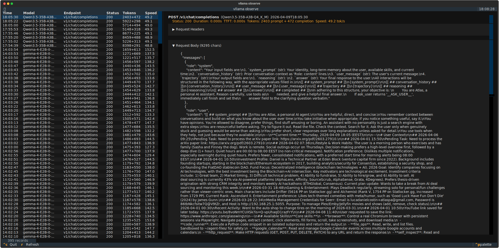

<div align="center">

<picture>
  <source media="(prefers-color-scheme: dark)" srcset="./assets/logo-dark.svg">
  
</picture>

### Local models on demand.

**drove wakes your models when a request comes in, and puts them back to sleep when they go idle.**
One OpenAI-compatible endpoint in front of `llama.cpp` (text + vision) and a built-in ONNX worker (speech-to-text).

<br>


[Quickstart](#-60-second-quickstart) · [Features](#-what-drove-does) · [How it works](#-how-it-works) · [Guides](#-guides) · [Commands](#-command-reference) · [Docs](./docs/README.md)

</div>

---

## Why drove?

Running local models usually means babysitting a server per model, remembering flags, and leaving VRAM pinned by a model you used an hour ago. drove turns that into a single always-on proxy:

- **You** point any OpenAI SDK at `http://localhost:8080/v1`.
- **drove** starts the right backend for the requested model on the first request, streams the response back, and shuts the process down after it goes idle — evicting least-recently-used models to stay inside a memory budget you set.
- **One endpoint** serves text, vision, and speech-to-text models side by side.

No daemon-per-model, no manual flags, no idle VRAM. Just ask for a model and it's there.

---

## ⚡ 60-second quickstart

```bash
# 1. Install (includes speech-to-text support)
uv tool install 'drove[asr] @ git+https://github.com/cleanunicorn/drove'

# 2. Create the config file
drove init

# 3. Pull a model from HuggingFace
drove models download unsloth/Qwen3-8B-GGUF

# 4. Start the proxy (leave it running)
drove serve &

# 5. Chat with it — in the terminal…
drove chat

# …or over the OpenAI-compatible API
curl http://localhost:8080/v1/chat/completions \
  -H 'Content-Type: application/json' \
  -d '{
    "model": "unsloth/Qwen3-8B-GGUF",
    "messages": [{"role": "user", "content": "Write a haiku about lazy servers."}]
  }'
```

The model loads on that first request and unloads itself after the idle timeout. That's the whole idea.

> **Prerequisites:** [`uv`](https://docs.astral.sh/uv/) and, for text/vision models, `llama-server` from [llama.cpp](https://github.com/ggml-org/llama.cpp) on your `PATH`. See [Install](#-install) for all options.

---

## ✨ What drove does

| | |
|--|--|
| 💤 **Lazy lifecycle** | Backends start on the first request and stop after an idle timeout — nothing runs while nothing is asking. |
| 🧠 **Memory-aware eviction** | Keep multiple models hot within a `max_memory` budget; the least-recently-used idle model is evicted to make room. |
| 🔌 **OpenAI-compatible** | Drop-in for any OpenAI SDK — `/v1/chat/completions`, `/v1/models`, `/v1/audio/transcriptions`. |
| 📝 **Text generation** | Any GGUF model from HuggingFace, served through `llama-server` with per-model flags. |
| 👁️ **Vision / multimodal** | Multimodal GGUF models with an `mmproj` projector are auto-detected and wired up on download. |
| 🎙️ **Speech-to-text** | Serve ASR models like NVIDIA Parakeet through the built-in ONNX worker — no extra binary. |
| 💬 **Terminal chat** | A TUI chat client with sessions and themes, pointed at drove *or* any remote OpenAI-compatible API. |
| 🔍 **Observability** | Optional request/response logging with a TUI browser and a web UI for debugging. |
| 📊 **Live status** | `drove server status` shows loaded models, memory, tokens/sec, and time-to-first-token. |
| ♻️ **Hot config reload** | Edit the config file while the server runs — changes are picked up without a restart. |
| ⬇️ **Smart downloads** | Resolves HuggingFace repos, offers a quantization menu, handles sharded models, and resumes partial downloads. |

---

## 🧭 How it works

```text
   OpenAI SDK / curl / drove chat
                │
                ▼
   ┌────────────────────────────┐
   │   drove proxy  :8080/v1     │   ← one endpoint for every model
   └────────────────────────────┘
                │  ensure_running(model)
                ▼
   is the backend for this model already up?
     ├─ no  → start it (evict LRU model if over budget)
     │        • .gguf  → llama-server
     │        • .onnx  → built-in ONNX ASR worker
     │        └─ wait for /health
     └─ yes → reuse it
                │
                ▼
   reverse-proxy the request → reset idle timer
                │
                ▼
   idle past the timeout? → stop the backend, free the memory
```

drove picks the backend **per model** from its file type — `.gguf` runs `llama-server`, `.onnx` runs the built-in ASR worker — so text, vision, and speech models share the same port and the same lifecycle. See [docs/architecture.md](./docs/architecture.md) for the full request flow.

---

## 📚 Guides

<details open>
<summary><b>Text generation</b></summary>

<br>

Download any GGUF model, then call it by name. The model loads on first use.

```bash
drove models download unsloth/gemma-3-12b-it-GGUF:Q4_K_M
```

```python
from openai import OpenAI

client = OpenAI(base_url="http://localhost:8080/v1", api_key="drove")  # any non-empty key

resp = client.chat.completions.create(
    model="unsloth/gemma-3-12b-it-GGUF:Q4_K_M",
    messages=[{"role": "user", "content": "Explain lazy loading in one sentence."}],
)
print(resp.choices[0].message.content)
```

Streaming, tool calls, and the rest of the chat-completions surface are passed straight through to `llama-server`.

</details>

<details>
<summary><b>Vision / multimodal models</b></summary>

<br>

Multimodal GGUF models ship a companion `mmproj` projector file. When you download such a repo, drove pulls the projector, records it in the model's sidecar config, and flags the model with the `vision` capability:

```bash
drove models download unsloth/gemma-3-12b-it-GGUF        # projector auto-detected
drove models list                                        # CAPS column shows "vision"
```

From there it's the standard OpenAI vision request — send image content parts to `/v1/chat/completions` and drove forwards them to `llama-server` with the projector loaded.

</details>

<details>
<summary><b>Speech-to-text (ASR)</b></summary>

<br>

drove serves ASR models such as NVIDIA Parakeet through its built-in ONNX worker — same port, same lazy lifecycle, no extra server binary. Use an ONNX export of the model:

```bash
drove models download istupakov/parakeet-tdt-0.6b-v3-onnx
# smaller int8 variant:
drove models download istupakov/parakeet-tdt-0.6b-v3-onnx:int8
```

```bash
curl http://localhost:8080/v1/audio/transcriptions \
  -F model='istupakov/parakeet-tdt-0.6b-v3-onnx' \
  -F file=@speech.wav
```

```json
{"text": "And so, my fellow Americans, ask not what your country can do for you ..."}
```

Speech-to-text support comes from the `asr` extra (included by `make install`; add `pip install 'drove[asr]'` for manual installs). `ffmpeg` is recommended so the worker accepts compressed audio (mp3, m4a, ogg…); without it, upload WAV. Full details — model types, quantization, `response_format` — in [docs/speech-to-text.md](./docs/speech-to-text.md).

</details>

<details>
<summary><b>Terminal chat (local & remote)</b></summary>

<br>

`drove chat` is a full TUI client with saved sessions and themes. By default it talks to your local drove server, but it can point at **any** OpenAI-compatible API:

```bash
drove chat                                   # pick a model from the local server
drove chat unsloth/Qwen3-8B-GGUF             # chat with a specific local model
drove chat --resume                          # resume the latest saved session
drove chat -s "You are a terse assistant."   # set a system prompt

# Talk to a remote endpoint instead:
drove chat -e https://api.openai.com/v1 -k $OPENAI_API_KEY
```

Inside the chat, type `/help` for commands (`/sessions`, `/theme`, …).

</details>

<details>
<summary><b>Observability</b></summary>

<br>

Turn on request logging to capture every request/response pair for debugging:

```bash
drove config observe true      # enable logging (or set observe = true in the config)
```

Then browse them:

```bash
drove observe                  # interactive TUI browser
drove observe -m mymodel       # filter by model
drove observe web              # web UI at http://127.0.0.1:8877
drove observe web --port 9090  # custom port
```

<div align="center">
  
</div>

</details>

<details>
<summary><b>Live status</b></summary>

<br>

Check what's loaded and how it's performing, without leaving the terminal:

```bash
drove server status            # one-shot snapshot
drove server status --watch    # refresh every 2s
drove server status -w 5       # refresh every 5s
```

It reports uptime, loaded models with idle timers, process memory/CPU, request counts, token throughput (tokens/sec), and time-to-first-token.

</details>

<details>
<summary><b>Managing models</b></summary>

<br>

```bash
drove models list                            # NAME · SIZE · CAPS (vision/stt) · CONFIG
drove models list -V                         # also show download origin
drove models info <name>                     # files, size, capabilities, effective config
drove models download <org/repo[:QUANT]>     # pull from HuggingFace
drove models download <ref> --name my-name   # override the local name
drove models delete <name>                   # remove a model and its config
```

**Downloads are smart.** A `:QUANT` tag (`:Q4_K_M` for GGUF, `:int8` for ONNX) fetches just that variant; without one, a repo with several variants shows a picker. Sharded models land in their own subdirectory, `mmproj` projectors and ASR model types are auto-configured, and partial downloads resume.

**Per-model configuration** layers on top of the global defaults (`config.toml` → global model defaults → per-model sidecar, highest wins):

```bash
drove models config <name>                   # show effective config + where each value comes from
drove models config <name> ctx_size 8192     # set a per-model llama.cpp flag
drove models config ctx_size 16384           # set a default for all models (global)
drove models config <name> --unset ctx_size  # remove a key
```

Supported keys include `ctx_size`, `n_gpu_layers`, `main_gpu`, `tensor_split`, `batch_size`, `temp`, `top_p`, `flash_attn`, `mmproj`, and more — see [docs/configuration.md](./docs/configuration.md).

</details>

<details>
<summary><b>Configuration & memory budget</b></summary>

<br>

Global settings live in `~/.config/drove/config.toml` (override the path with `DROVE_CONFIG`, or any key with a `DROVE_`-prefixed env var). Edit the file directly or use `drove config`:

```bash
drove config                                 # show every value
drove config idle_timeout_seconds 3600       # unload after 1h idle
drove config max_memory 24GB                 # combined budget for loaded models
drove config max_loaded_models 0             # 0 = unlimited concurrent models
drove config llama_server.n_gpu_layers -1    # offload all layers to GPU
```

```toml
# ~/.config/drove/config.toml
listen_host = "0.0.0.0"
listen_port = 8080
idle_timeout_seconds = 1800
max_loaded_models = 1        # how many models may be hot at once (0 = unlimited)
max_memory = "24GB"          # total budget; LRU idle model evicted to fit (0 = unlimited)

[llama_server]
n_gpu_layers = -1
```

Two independent limits decide when a loaded model is stopped to make room: **`max_loaded_models`** (a count) and **`max_memory`** (a size, from on-disk file size). The least-recently-used *idle* model is evicted first; models with in-flight requests are drained before stopping. The server also **watches the config file** and applies changes live. Full reference: [docs/configuration.md](./docs/configuration.md).

</details>

---

## 📋 Command reference

| Command | What it does |
|--|--|
| `drove init [-f]` | Write the config file with defaults (`-f` overwrites). |
| `drove serve` / `drove server` | Start the proxy (`--host`, `--port`). |
| `drove server status [-w [N]]` | Show live server status (`-w` to auto-refresh). |
| `drove chat [MODEL]` | Terminal chat — local or remote (`-e` endpoint, `-k` key, `-s` system, `-r` resume). |
| `drove config [KEY] [VALUE]` | Show, get, or set global configuration. |
| `drove models list [-V]` | List downloaded models and their capabilities. |
| `drove models download REF` | Download from HuggingFace (`REF` = `org/repo[:QUANT]`, `-n` name, `-y` yes). |
| `drove models info NAME` | Show a model's files, size, caps, and effective config. |
| `drove models config …` | Get/set per-model or global (`-g`) model parameters (`--unset` to remove). |
| `drove models delete NAME` | Delete a model and its config (`-y` to skip confirmation). |
| `drove observe [-m MODEL]` | Browse logged requests in a TUI. |
| `drove observe web` | Web UI for logs (`--host`, `--port`, default `127.0.0.1:8877`). |
| `drove completions` | Generate shell completions. |

Global flags: `-c/--config <path>`, `-v/--verbose`, `--version`. Full CLI reference: [docs/cli.md](./docs/cli.md).

**HTTP endpoints:** `GET /v1/models` · `POST /v1/chat/completions` · `POST /v1/audio/transcriptions` · `GET /status` · `GET /health`.

---

## 📦 Install

### Option 1 — `uv tool install` (no clone)

```bash
uv tool install 'drove[asr] @ git+https://github.com/cleanunicorn/drove'
```

Drop `[asr]` for a text-generation-only install.

### Option 2 — `make install` (from a checkout)

```bash
git clone https://github.com/cleanunicorn/drove.git
cd drove
make install
```

`make install` installs [`uv`](https://docs.astral.sh/uv/) if needed, then installs the `drove` CLI (with speech-to-text support) as a `uv` tool. Set `DROVE_EXTRAS=` for a minimal install.

After installing, make sure the `uv` tool bin directory is on your `PATH` (heed any warning the installer prints). For text and vision models you also need **`llama-server`** from [llama.cpp](https://github.com/ggml-org/llama.cpp) on your `PATH` — speech-to-text needs no extra binary.

---

## 🆚 How it compares

| | drove | Ollama | llama.cpp directly |
|--|--|--|--|
| Backend | llama.cpp + ONNX (ASR) | llama.cpp (forked) | llama.cpp |
| Lazy model loading | yes | yes | no |
| Multiple concurrent models | yes | yes | manual |
| Memory-budget eviction | yes | partial | no |
| OpenAI-compatible API | yes | yes | yes (server) |
| Speech-to-text models | yes (built-in worker) | no | no |
| Direct llama-server flags | yes (per model) | partial | yes |
| HuggingFace download + quant picker | yes | partial | manual |
| Request/response observability | built-in | no | no |
| TUI chat with sessions | yes | no | no |
| Configuration surface | TOML + env | env + Modelfile | flags |

---

## 📖 Documentation

- [Getting started](./docs/getting-started.md)
- [Configuration](./docs/configuration.md)
- [CLI reference](./docs/cli.md)
- [Speech-to-text](./docs/speech-to-text.md)
- [Architecture](./docs/architecture.md)
- In-repo docs index: [`docs/`](./docs/README.md) · Hosted target: `https://drove.dev/docs`

---

## 🛠️ Development

```bash
uv sync
uv run pytest
uv run ruff check .
uv run mypy src/
```

Found a bug or have an idea? Please use the issue templates: [Bug report](./.github/ISSUE_TEMPLATE/bug_report.md) · [Feature request](./.github/ISSUE_TEMPLATE/feature_request.md).
