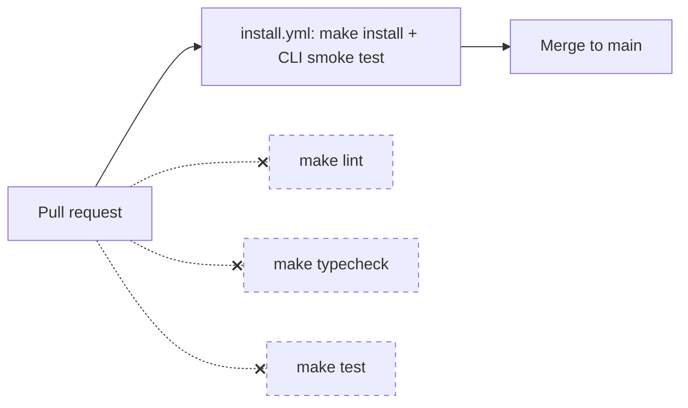
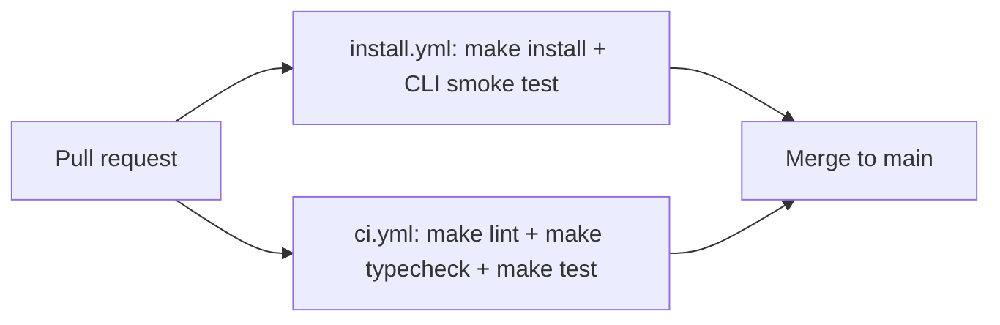

# Proposal: Add a CI quality gate (`make lint` + `make typecheck` + `make test`)

**Status:** Proposed
**Author:** Architect (automated structural review)
**Risk:** Low
**Approver:** repo owner (@cleanunicorn) — single-maintainer project, no separate infra/backend leads to route this to

## Why now

`AGENTS.md` documents `make lint`, `make typecheck`, and `make test` as the required
local workflow, and the repo has 13 test files (~3.2k lines) and `mypy --strict` /
`ruff` configured in `pyproject.toml`. None of that runs in CI. The only workflow
that touches the source tree on every PR is `install.yml`, which does a `make
install` + smoke test of four CLI commands (`--help`, `config`, `init`,
`models list`) — none of which import `drove.server_manager`.

That gap isn't theoretical. `src/drove/server_manager.py:156` currently reads:

```python
except psutil.NoSuchProcess, psutil.AccessDenied:
```

This is Python 2 exception syntax — a `SyntaxError` under Python 3, confirmed with
`python3 -c "import ast; ast.parse(open('src/drove/server_manager.py').read())"`.
It has been present since the module's first commit (`cd38bbd`, when the package
was still named `vllama`) and is unchanged on `main` today. Because
`server_manager.py` is imported by `drove serve` — the project's core command —
this means `drove serve` cannot start at all on any Python 3 interpreter.
`ruff check .` reports this in under a second (rule `E999`); `make test` would
fail to even collect. Neither runs in CI, so nothing has ever caught it.

This isn't a report on that one bug (that's a BugBuster-shaped fix, not an
architecture change) — it's evidence for the actual structural gap: **the repo
has quality tooling but no CI gate enforcing it**, so regressions like this can
sit on `main` indefinitely.

## Proposal

Add one new workflow, `.github/workflows/ci.yml`, that runs `make lint`, `make
typecheck`, and `make test` on every PR and on push to `main` — mirroring what
`install.yml` already does for `make install` (same `astral-sh/setup-uv` setup,
same trigger shape). No changes to existing workflows or application code.

### Before



*(dashed = documented in AGENTS.md, never actually run)*

### After



## Migration plan (staged, reversible)

1. **Add `ci.yml`, non-blocking.** Same trigger as `install.yml`
   (`pull_request`, `push: branches: [main]`), same `astral-sh/setup-uv` step.
   Three steps: `make lint`, `make typecheck`, `make test`. Not yet added to
   branch protection, so it reports status but blocks nothing. This step alone
   will surface the `server_manager.py` syntax error (and any other latent
   issues) as a visible check, without breaking anyone's in-flight PR.
2. **Observe for a few days / PRs.** Confirm the three `make` targets are
   stable in the GitHub Actions environment (e.g. `onnx-asr` extra installs
   cleanly, no tests need `llama-server` on `PATH` or network access beyond
   package installation). Fix anything that's a CI-environment issue rather
   than a real bug, same as `install.yml` was presumably hardened.
3. **Mark `ci.yml` as a required status check** in branch protection for
   `main` (GitHub UI action by the repo owner — outside this PR's diff).
   This is the only non-reversible-feeling step, and it's a one-click revert
   if it ever proves too strict.

Rollback at any stage: delete `ci.yml` or remove it from required checks —
`install.yml` and `release.yml` are untouched throughout.

## Performance impact

- `ruff check .` and `mypy --strict src/` are both sub-second to low-single-digit-second
  on a codebase this size (~7k lines in `src/`).
- `pytest` over 13 files / ~3.2k lines: no external I/O observed in a scan of
  the test files (mocks/monkeypatch used throughout), so a rough estimate is
  well under a minute.
- Net: adds roughly **30-60s** to per-PR CI wall-clock, running in parallel
  with the existing `install.yml` job (separate workflow, no shared
  dependency), so it doesn't lengthen the critical path to green.

## Test strategy

The mechanism's own validation is running it against this repository's current
`main`: it should immediately fail on the `server_manager.py` syntax error,
which is a concrete, reproducible proof that the gate catches what it's meant
to catch. Beyond that, no new application tests are needed — this proposal
adds no application code.

## Timeline estimate

- Workflow file: under a day (it's ~30-40 lines, modeled directly on the
  existing `install.yml`).
- Observation window before flipping the check to required: 2-3 days /
  a handful of merged PRs.
